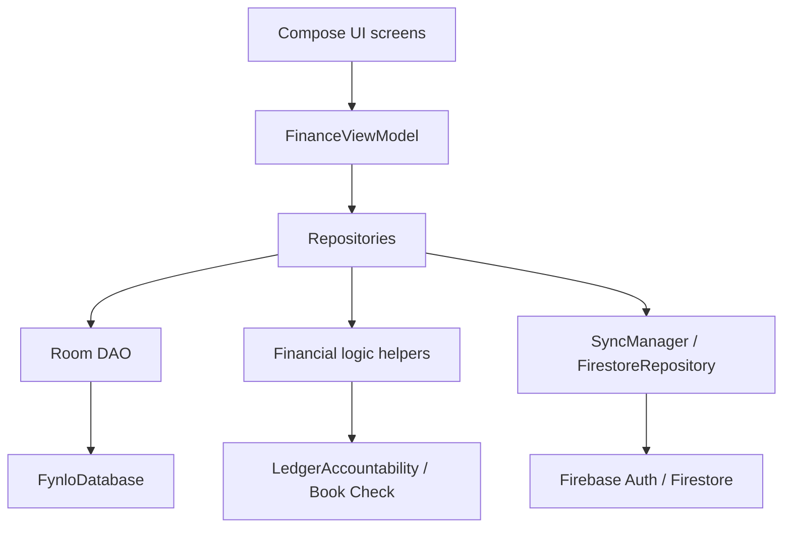

# Architecture And File Map

## High-Level Shape

## Important Files

| Area | Files | Why it matters |
|---|---|---|
| App build | `app/build.gradle.kts`, root Gradle files | Flavors, R8, Firebase plugins, versioning, native-symbol tasks. |
| Database | `app/src/main/java/app/fynlo/data/FynloDatabase.kt`, `app/src/main/java/app/fynlo/data/FynloDao.kt`, `app/schemas/app.fynlo.data.FynloDatabase/31.json` | Room schema, migrations, source-of-truth queries. |
| View model | `app/src/main/java/app/fynlo/FinanceViewModel.kt` | Main UI action coordinator. |
| Repositories | `FinanceRepository.kt`, `AccountRepository.kt`, `LendingRepository.kt`, `DebtRepository.kt`, `InvestmentRepository.kt`, `ExpenseRepository.kt` | Money action execution and persistence. |
| Interest logic | `InterestEngine.kt`, `InterestPolicy.kt`, `DebtLiabilityCalculator.kt` | Accrual, due, paid-ahead, waiver behavior. |
| Ledger trust | `LedgerAccountability.kt`, `TransactionSafety.kt`, `TransactionOrdering.kt`, `OrphanTransactionsScanner.kt` | Book Check, idempotency, ordering, repair safety. |
| Sync | `SyncManager.kt`, `FirestoreRepository.kt`, `FirestoreReset.kt` | Cloud backup, reset, listener lifecycle. |
| Auth | `AuthManager.kt`, `GoogleSignInHelper.kt`, `LoginScreen.kt`, `ProfileScreen.kt` | Google sign-in, guest/local mode, account linking. |
| Main UI | `HomeScreen.kt`, `HomeScreenModern.kt`, `LendingScreen.kt`, `DebtScreen.kt`, `InvestmentScreen.kt`, `SettingsScreen.kt`, `GlobalSearchScreen.kt`, `LoanCalculatorScreen.kt` | Screens most often touched by user reports. |
| Statements/history | `AccountStatementScreen.kt`, `TransactionHistoryScreen.kt` | Running balance and transaction clarity. |
| Models | `Borrower.kt`, `Debt.kt`, `Payment.kt`, `DebtPayment.kt`, `Transaction.kt`, `Investment.kt`, `AuditEvent.kt`, `MonthlyClose.kt`, `SyncConflict.kt` | Core ledger records. |
| Tests | `InterestPolicyTest.kt`, `LedgerAccountabilityTest.kt`, `MoneyActionIdempotencyDataIntegrityTest.kt`, `FinancialSummaryCalculationTest.kt`, `SyncLogicTest.kt` | Regression guards. |
| Release docs | `PROJECT_STATE_FOR_AI.md`, `docs/release-handoff/2026-06-20-internal-testing-knowledge-hub.md`, `RELEASE_WORKLOG_2026-06-12_TO_2026-06-15.md` | Continuity for agents. |

## Cross-Cutting Flow Notes

### Money action flow

1. UI validates user input and enables action button.
2. `FinanceViewModel` routes action to the correct repository.
3. Repository writes source record, transaction rows, audit events, and account effects together where possible.
4. DAO queries rebuild summaries from stored rows.
5. Sync layer uploads local state when authenticated.

### Interest flow

1. Loan/debt start date is the accrual anchor.
2. Payment rows provide paid principal/interest.
3. Interest policy derives accrued, due, paid-ahead, waived, and unclear old-interest states.
4. Detail screens show simple totals; Book Check handles review actions.

### Cloud flow

1. User may use app locally without sign-in.
2. User can sign in later from settings/profile/security.
3. Local data must be preserved.
4. Cloud sync starts only after valid auth.
5. Reset cloud backup must stop active listeners before clearing/repushing.
